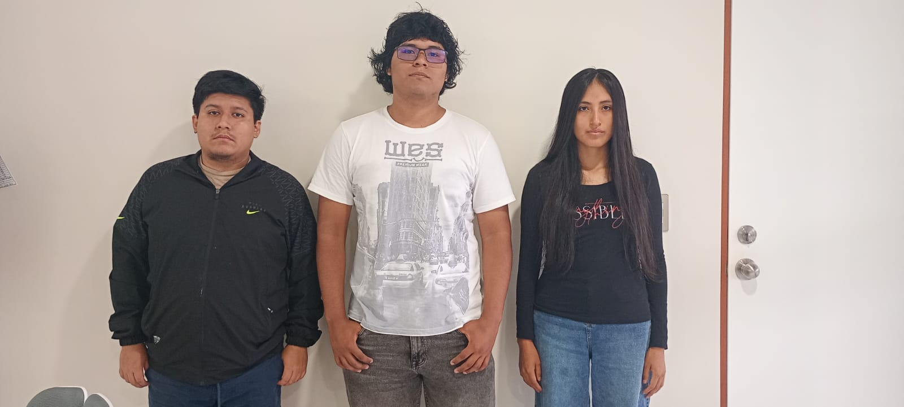

# 👨‍💻 Equipo 5 - Procesos de Innovación en Ingeniería  
Carrera de Ingeniería Informática
Universidad Peruana Cayetano Heredia  

---

## 🌍 Descripción del Equipo
Somos el Equipo 5 del curso **PIIF2 2026-1**, conformado por estudiantes de la carrera de Ingeniería Informática.  

Nuestro objetivo es aplicar la **metodología de diseño** para generar soluciones innovadoras con impacto social, tecnológico y ambiental.  

Nos interesa trabajar en los siguientes **Objetivos de Desarrollo Sostenible (ODS):**

- 🌱 **ODS 3:** Salud y Bienestar   
- 🏗️ **ODS 9:** Industria, Innovación e Infraestructura  
- 🏙️ **ODS 11:** Ciudades y Comunidades Sostenibles  
- 🌎 **ODS 13:** Acción por el Clima

---

## 📸 Fotografía del Equipo

  
**Figura 1.** Fotografía del equipo 5  

---

## 👥 Integrantes del Equipo

| Foto | Nombre | Rol | Intereses |
|------|--------|-----|----------|
|  | Joaquin Mayta | Líder del equipo | Innovación social, sostenibilidad |
|  | Elio Melgarejo | Responsable de investigación | Gestión ambiental, desarrollo comunitario |
|  | Rocio Pillaca | Diseñador/a | Diseño de prototipos, creatividad aplicada |
|  | Daniel Oliva | Programador/a - Modelador/a | Programación, análisis de datos, simulación |

---

## 📌 Resumen Final
Este README resume quiénes somos, qué nos motiva y en qué **ODS** queremos enfocar nuestro trabajo durante el curso.  

---

